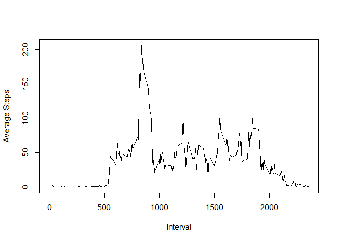

# Reproducible Research PA 1
Anne Saylor  
Saturday, June 13, 2015  


To begin, we load the necessary packages we will use later in the code,
then read in the activity data.


```r
##Load relevant packages
require(sqldf)
```

```
## Loading required package: sqldf
## Loading required package: gsubfn
## Loading required package: proto
## Loading required package: RSQLite
## Loading required package: DBI
```

```r
library(sqldf)
require(lubridate)
```

```
## Loading required package: lubridate
```

```r
library(lubridate)

##Read the data.
##Per instructions, not including code to download data 
##as data file is in repository.
rawdata <- read.csv("activity.csv")
```

Next, we calculate total number of steps taken per day, ignoring NA values per the instructions. (As NA values will prevent summation, they are removed.) Since we call sqldf for the first time, we also see an additional package loading.


```r
dfraw <- as.data.frame(rawdata)
df <- dfraw[complete.cases(dfraw),]
summary <- sqldf("SELECT date, SUM(steps) AS TotalSteps from df GROUP BY date")
```

```
## Loading required package: tcltk
```

Then, we make a histogram of the total number of steps per day.


```r
hist(summary$TotalSteps, main="Total Steps Histogram", 
     col = "blue", xlab="Total Steps")
```

 

We then calculate the mean and median of the total number of steps per day. (The instructions advised basing this on total steps and not breaking down by day.)


```r
mean(summary$TotalSteps)
```

```
## [1] 10766.19
```

```r
median(summary$TotalSteps)
```

```
## [1] 10765
```

Next, we review obtain and visualize the average daily activity pattern in a time series plot.


```r
daily <- sqldf("SELECT interval, AVG(steps) 
               AS AverageSteps 
               FROM df 
               GROUP BY interval")

plot(daily, type="l", xlab = "Interval", ylab= "Average Steps")
```

 

We can also see which interval has the maximum number of steps on average.


```r
sqldf("SELECT interval, MAX(AverageSteps) FROM daily")
```

```
##   interval MAX(AverageSteps)
## 1      835          206.1698
```

We then turn our attention to missing values. We first see how many total rows have NA values.


```r
nrow(as.data.frame(which(is.na(dfraw)==TRUE)))
```

```
## [1] 2304
```

We can impute missing values. In this case, I start by calculating the average steps by interval, as this will be used to substitute missing values for that interval.


```r
means <- sqldf("SELECT interval, AVG(steps) AS AvgSteps FROM df GROUP BY interval")
```

Then, we can bring in the average values alongside the regular data and replace the NA values with the corresponding average for that interval.


```r
withavg <- sqldf("SELECT dfraw.date, dfraw.steps, dfraw.interval, A.AvgSteps 
                 FROM dfraw LEFT JOIN means A ON dfraw.interval = A.interval")
withavg <- as.data.frame(withavg)
withavg$steps <- ifelse(is.na(withavg$steps), withavg$AvgSteps, withavg$steps)
final <- sqldf("SELECT date, interval, steps FROM withavg")
```

Here, we resummarize the data and a create new histogram with the new data set.


```r
newsummary <- sqldf("SELECT date, SUM(steps) AS TotalSteps from final GROUP BY date")

hist(newsummary$TotalSteps, main="Total Steps Histogram", 
     col = "blue", xlab="Total Steps")
```

 

We can then compare the mean and median values to those from before. They are slightly different than those produced earlier. Coincidentally, the mean and median are the same number (the correctness of this answer has been verified using the NA substitution method I chose.)


```r
mean(newsummary$TotalSteps)
```

```
## [1] 10766.19
```

```r
median(newsummary$TotalSteps)
```

```
## [1] 10766.19
```

Finally, we turn our attention to variations in activity patterns between weekends and weekdays. We first must apply the day of week names to the data.


```r
days <- wday(final$date, label=TRUE, abbr=FALSE)
days <- as.data.frame(days)
finaldays <- cbind(final, days)
```

We then create a factor variable to indicate whether the day is a weekday or weekend. In this instance, since I am used to working with SQL, I chose a CASE statement to create this classification.


```r
dayclass <- sqldf("SELECT date, interval, steps, days, 
  CASE WHEN days IN ('Sunday', 'Saturday') THEN 'Weekend' ELSE 'Weekday' END 
  AS daytype
  FROM finaldays")
dayclass$daytype <- as.factor(dayclass$daytype)
```

We can summarize the average activity by interval on weekends vs. weekdays.


```r
weekendsummary <- sqldf("SELECT interval, AVG(steps) AS AvgSteps FROM dayclass WHERE daytype = 'Weekend' GROUP by interval")
weekdaysummary <- sqldf("SELECT interval, AVG(steps) AS AvgSteps FROM dayclass WHERE daytype = 'Weekday' GROUP by interval")
```

We can then plot the differences, and we see that activity patterns do in fact vary by weekend vs. weekday. I chose to use the base plotting system. The example was in lattice, but specified that any plotting system could be used.


```r
par(mfrow = c(1,2))
plot(weekendsummary, type="l", xlab = "Interval", ylab= "Average Steps", main = "Weekend")
plot(weekdaysummary, type="l", xlab = "Interval", ylab= "Average Steps", main = "Weekday")
```

 

This concludes this assignment. Thanks for reading.
